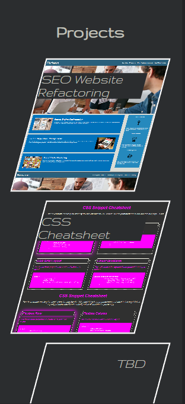

# Lunirs Portfolio Page

## Description

The purpose in creating this portfolio page is to display to hiring managers and companies who I am, what projects I have done, and ways to contact me. This page will undergo many changes as I get more familiar with HTML, CSS, and Javascript.

Using my currenty knowledge of HTML and CSS, I designed my portfolio page to be accessible to users of mobile devices, tablets, and PC as the page will scale accordingly.

I will be updating this page as I learn and will be updating the README file here with more updates.

Here is a link to the deployed site: [Click Here](https://lunirs.github.io/lunirs-portfolio-page/)

### Updates

1.  TBD

## Installation

With building my portfolio page, I initially formatted the things I would need.

1. Header
2. Navigation Bar
3. Banner Image
4. Body section
   1. Which contains the main body with 3 Article Sections for my 3 different main content.
5. Footer Section to contain my copyright

I have gone for a more dark mode theme for my profile page as the default light mode always blinds my eyes. (Mainly just wanted to say that it was due to my own preference)

I utilized the navigation bar to allow users to click on different section to be led to the appropriate content portion on the page.

Moving on to my main content, I have separated it into 3 different articles.

1. About Me
2. Projects
3. Contact Me

For the about me, I added a photo of myself (Last year November) at a dental convention while I was working in my previous company. I then added a brief description of myself.

The Projects section incorporated flex box to create quadrilaterals to encapsulate photos of my projects and create the appropriate space. The users can click on each box and be led to the deployed links that are present on the page. The boxes were styled to have my main project to be displayed as the largest by targetting the first child of the flex container.

The Contact me section contains my personal information such as my mobile number, email, link to my GitHub profile, as well as my linked in.

Lastly, the footer section contains the copyright information.

As mentioned before, I have made my page accessible to all devices. This was done by using media queries to give styles when limiting the page to the max width.

## Usage

Please see the screenshots below to see my portfolio page on different devices.

### Desktop

### Mobile

## Credits

Here are the lsit of resources I have used throughout working on this portfolio page.

CSS Fontstack was used to find a font I liked so I could learn how to import new fonts and apply it through my CSS.

[W3 Schools CSS Background-Image Property](https://www.w3schools.com/cssref/pr_background-image.asp)

[MDN CSS First child](https://developer.mozilla.org/en-US/docs/Web/CSS/:first-child)

[CSS Fontstack](https://www.cssfontstack.com/Gruppo)

[W3 Schools Pseudo-classes](https://www.w3schools.com/css/css_pseudo_classes.asp)

## License

Copyright (c) [2022] [Daniel Hong]
